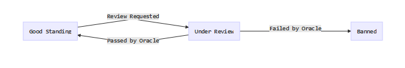

Contract Design
===============

There are three contracts:

1. OpenWit - which represents an individual blog, its data be stored on IPFS but referenced by an IPFS hash stored in the contract
2. OpenWitRegistry - which encapsulates a "community" of blogs that conform to a (hardcoded) Code of Conduct
3. OpenWitOracle - an oracle contract that records requests for Code of Conduct reviews and allows an off chain service to pass or fail the blog based on the Code of Conduct rule that no blog entry include the word `inheritance`

In general the design is that anyone should be able to create their own OpenWit blog, and on which they are free to write whatever they like. However, they can opt in to a code of conduct by creating a blog through a registry and paying the stake. A registry is created with a supporting Oracle that can determine if a blog meets the Code of Conduct. So blogs can join a community and be forced out of a community for bad behaviour.

OpenWit
-------

The OpenWit contract extends two OpenZepplin contracts directly and implicity a third:

1. [Destructible](https://openzeppelin.org/api/docs/lifecycle_Destructible.html)
2. [Pausable](https://openzeppelin.org/api/docs/lifecycle_Pausable.html)
3. [Ownable](https://openzeppelin.org/api/docs/ownership_Ownable.html)

The contract is designed to provide governance over admin tasks that are typically done on a blog, while
offloading the blogs posts and data to IPFS. I wanted blogs to be transferable to other owners.

The contract is `ownable`, its owner being set to the sender of the transaction that creates it. The owner
can be changed after creation. Being ownable provides basic `access control`, allowing the contracts functionality to be limited to access by the owner. Only the owner can add new posts to the blog (that is update its IPFS hash), transfer ownership, lock the blog, unlock the blog, or destroy the blog contract.

The OpenWit contract implements the `circuit breaker` pattern by extending the `Pausable` zepplin contract. This blocks new updates and ownership transfer but not destruction of the blog. It also provides a mechanism for indicating to readers that the author will not be posting for a while.

The option to destroy the blog is provided through extending `Destructible`, it is available even if the contract is `paused` by the circuit breaker. This means a bad blog can always be removed by an unhappy owner, which given I never implemented delete is handy. 

OpenWitRegistry
---------------

The registry is a factory. By creating blogs through the registry rather than directly we have a mechanism, both on chain and off for determining whether a blog belongs to a community and so meets a
code of conduct.

The registry `fails early` when creating a blog by enforcing that the minimum stake was met by a `meetStake` modifier.

The registry uses a state machine to govern Code of Conduct requests. The registry stores the state of
each blog as it stands in regard to the Code of Conduct. The registry controls a `state machine` that
can advance the blog through the Code of Conduct review process. The states are:

The registry guards against the oracle going offline by allowing anyone to reset a blogs state to `GoodStanding` if the blog is currently `UnderReview` and more than 240 blocks have passed since
the review was requested without an answer from the Oracle Service.

OpenWitOracle
-------------

An `Oracle` is needed in this application for two reasons. Firstly, the data that the Code of Conduct review
will use is not available on-chain. The review is based off of the content of the blog posts and
that data is stored on IPFS. The calculation itself, even in its noddy form, will require potentially arbitary large looping over posts to determine if all meet the rules; if done on chain this would represent
a potential DOS attack.

The expense of blog data is offloaded to IPFS and the expense of calculating whether a blog meets the code of conduct is offloaded to an offchain oracle. However, there is no mechanism for challenging the oracle, you just have to trust it. I looked at merkle proofs as a possible mechanism for double checking the oracle, but it is not supported yet on IPLD.
