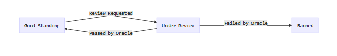
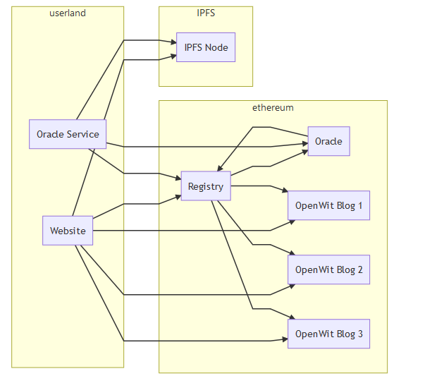

Reviewer Notes
==============

Hello and good luck.

## Table of Contents

- [Project Overview](#project-overview)
- [Pointers for the Grading Rubric](#pointers-for-the-grading-rubric)

Project Overview
----------------

This app is not one of the suggested ideas (I don't know what I was thinking either), instead I decided to look at what a twitter clone on ethereum might look like.

The frontend is a truffle project built on react, the backend is three interacting ethereum contracts and one lib that can be found under the contracts directory:

1. [OpenWit.sol](../contracts/OpenWit.sol) - representing (and deployable on its own) a single blog, the contract governs the blog, but the data of the blog (the text of the entries) is stored off chain on [IPFS](https://ipfs.io)
2. [OpenWitRegistry.sol](../contracts/OpenWitRegistry.sol) - a contract encapsulating the idea of a community of blogs all governed by a hardcoded and smart contract enforceable Code of Conduct.
3. [OpenWitOracle.sol](../contracts/OpenWitOracle.sol) - an oracle that determines whether a blog (an OpenWit contract) is in violation of the Code of Conduct
4. [SharedStructs.sol](../contracts/SharedStructs.sol) - some shared Structs and state enums that are used by both the registry and the oracle

The frontend website points automatically to a deployed OpenWitRegistry. New blogs can be created through the registry, it requires a `0.1 ether` stake from the creator. A registry gathers a group of blogs together and provides a mechanism for enforcing a Code of Conduct. Owners can update their blogs and perform admin functions (destroy, lock and transfer ownership). Any logged in user can request a Code of Conduct review on a blog for the registry.

The Code of Conduct is intentionally stupid, the only rule is that blog entries can't include the word `inheritance`. A Code of Conduct Review is requested through the registry contract, which delegates to the Oracle contract. An off chain Oracle Service implemented as a node.js process (located at [./oracle/oracleService.js](../oracle/oracleService.js)) monitors the Oracle contract for requests and answers them, it also then triggers an update of the blogs status as considered by the registry. A blog in the registry moves through the following states:



Getting banned burns the blogs stake of 0.1 ether that is put down on blog creation through the registry (and the price of the OpenWit approved badge on the webpage).

The blogs entries are not stored on chain. Instead they are pushed to a locally running IPFS node. The data is not stored as a file on IPFS but as a merkle tree using [IPLD](https://ipld.io); so each blog entry is its own IPLD object on IPFS and points at the next blog entry. If you are so inclined you can look at the structure by taking the IPFS Hash stored against the OpenWit contract (viewable on the settings page) and querying your local IPFS node:

```bash
$ ipfs dag get zdpuAoa3PHGNHjgqWqcKxcutRiAx6yVanUGvjJpqFLt2hMCc8 | jq .
// {
//   "author": "kanej",
//   "entries": {
//   "/": "zdpuAyCVDnkTHVLzvFQc8YxbqzYYdkfGMQDKpy1hGXosXJ8BF"
//   },
//   "name": "An Example"
// }
$ ipfs dag get zdpuAoa3PHGNHjgqWqcKxcutRiAx6yVanUGvjJpqFLt2hMCc8/entries | jq .
// {
//   "next": {
//     "/": "zdpuAztkzEGF7doFmWAFp3NMD2EJkRyLCjE64ZwZ2PDHUwfu2"
//   },
//   "text": "An example OpenWit blog"
// }
```
I used two node libs I wrote to implement this ([permawit](https://github.com/kanej/permawit) - a blog structure on IPLD and [merkling](https://github.com/kanej/merkling) - a js object to IPLD mapper).

Local IPFS development can be a bit tricky. The simplest approach is to run the go implementation [go-ipfs](https://dist.ipfs.io/#go-ipfs) locally, so [after install](https://dist.ipfs.io/#go-ipfs):

```bash
$ ipfs init # to setup a new ipfs repo - default ~/.ipfs
$ ipfs daemon # to actually start a local IPFS node
```

 The OpenWit website attempts to connect to IPFS first by testing for `window.ipfs`. This will be available if you have installed [ipfs-companion](https://github.com/ipfs-shipyard/ipfs-companion) which is a plugin for Firefox and Chrome that will give your browser IPFS powers in the same way that Metamask does for Ethereum. If `window.ipfs` is not available the OpenWit website will fallback to booting an client-side IPFS node in the page itself. The downside is that connections between that node and other nodes (for instance your local go-ipfs node to which the oracle connects) are less predictable and consistent. I would recommend installing ipfs-companion and connecting it to your running local IPFS node.

The architecture of the app then:



Pointers for the Grading Rubric
-------------------------------

If I can be so bold and to save some time.

The `Final Project Guide` suggests providing Use Cases for projects that have went rogue
and implemented their own idea. The Use Cases for the app are documented in [use_cases.md](./use_cases.md), along with a walkthrough of each.

#### User Interface Requirements

1. Run app on a dev server locally - you can run the OpenWit website with `npm run start`. Ensure ganache is running, for more details see the Basic Setup of the README.md
2. Should be able to visit a URL and interact with the app - website should be running on [http://localhost:3000](http://localhost:3000)
3.1 Display the current account - the homepage will show your web3 account if you are logged in as part of the welcome message
3.2 Sign transactions using metamask - if you are logged in try running through creating a blog by clicking the `Setup Microblog` button
3.3 Reflect updates to the contract state - creating a blog and adding entries should show UI updates

#### Testing

There are 5 or more tests for each of the contracts:

1. [OpenWit.sol](../contracts/OpenWit.sol) - is covered by tests in [./test/openwit.js](../tests/openwit.js)
2. [OpenWitRegistry.sol](../contracts/OpenWitRegistry.sol) - is covered by tests in [./tests/openwitregistry.js](../test/openwitRegistry.js)
3. [OpenWitOracle.sol](../contracts/OpenWitOracle.sol) - is covered by tests in [./tests/openwitOracle.js](../test/openwitoracle.js)

The tests can be run with:

```bash
truffle test
```

#### Design Pattern Requirements

1. Implement a circuit breaker / emergency stop - the [OpenWit.sol](../contracts/OpenWit.sol) contract implements a circuit breaker by extending the [OpenZepplin Pausable](https://openzeppelin.org/api/docs/lifecycle_Pausable.html) contract, as does [OpenWitOracle.sol](../contracts/OpenWitOracle.sol).
2. What other design patterns have you used or
not used? - the design patterns are documented in [design_pattern_descisions.md](./design_pattern_desicions.md)

#### Security Tools / Common Attacks

1. Explain what measures ... - the security considerations are documented in [avoiding_common_attacks.md](./avoiding_common_attacks.md)

#### Library / EthPM

1. At least one of the project contracts includes an
import from a library/contract - [OpenWit.sol](../contracts/OpenWit.sol) imports and extends `Destructable` and `Pausable` from the OpenZepplin project. [OpenWitRegistry.sol](../contracts/OpenWitRegistry.sol) and [OpenWitOracle.sol](../contracts/OpenWitOracle.sol) use a shared library [SharedStructs.sol](../contracts/SharedStructs.sol) for defining structs and enums used in both

#### Additional Requirements

1. Smart Contract code should be commented - the contracts are all commented

#### Stretch Goals

1. Project uses IPFS - Yes
2. Project uses uPORT - nope
3. Project uses ENS - nope
4. Project uses an Oracle - Yes
5. Project implements the upgradable pattern - nope
6. Project includes a contract in LLL/Vyper - nope but Lisp forever
6. Testnet Deployment - nope
