Use Cases
=========

## Table of Contents

- [Setup for basic Use Cases](#Simple-Setup-for-basic-Use-Cases)
- [Create a new blog linked to the OpenWitRegistry](#Create-a-new-blog-linked-to-the-OpenWitRegistry)
- [Add a new post to your blog](#Add-a-new-post-to-your-blog)
- [Lock your blog](#Lock-your-blog)
- [Transfer ownership of your blog to another account](#Transfer-ownership-of-your-blog-to-another-account)
- [Destroy your blog](#Destroy-your-blog)
- [Report a blog in violation of the registries Code of Conduct](#Report-a-blog-in-violation-of-the-registries-Code-of-Conduct)

Setup for Use Cases
-------------------

IPFS can be a little tempremental. You should run a local `go-ipfs` node with the `IPFS Companion` browser plugin. Please refer to the install and usage sections of the [README.md](../README.md) for more details.

Create a new blog linked to the OpenWitRegistry
-----------------------------------------------

A registry ties multiple blogs together, and allows enforcement of a Code of Conduct through
a smart contract.

An empty registry will have been deployed with the setup migration. If you ran the test data setup script you may see some example blogs on the homepage. To create a new blog:

1. Go to the homepage at `http://localhost:3000`
2. Click on the `Setup Microblog` button to go to the Setup Page (note the homepage recognises which account you are logged in as in Metamask)

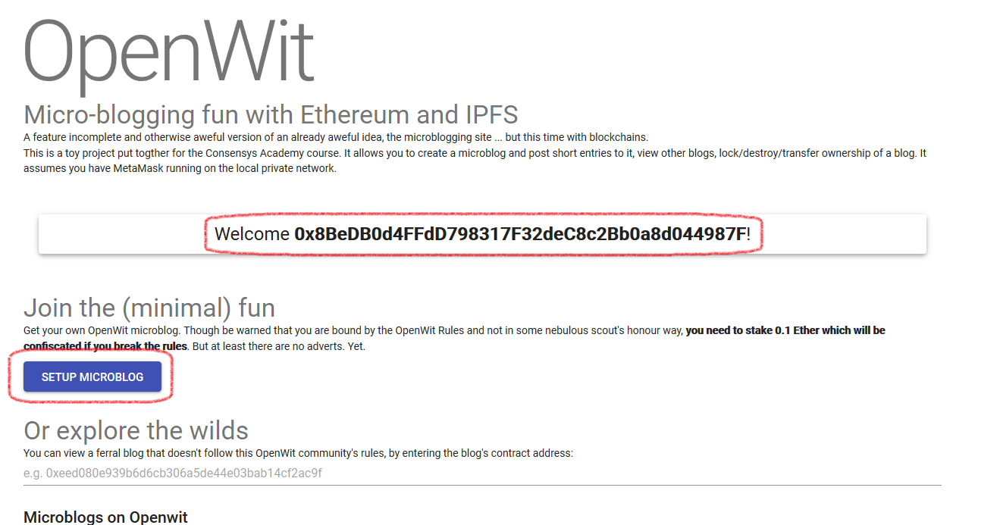

3. Enter in a title for the blog and an author, both must be at least 3 characters, and click `Setup`

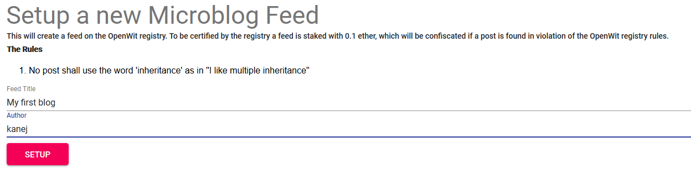

4. Creating a blog requires staking 0.1 ether on top of the gas used in its creation. Failing to keep the (hardcoded) rules of OpenWit will allow others to claim that stake and ban the blog from the registry. The only rule currently is the noddy example rule that the lowercase word `inheritance` is banned from posts. I am sure you can think of more appropriate words to ban and more sophisticated rules generally, but if you are from the Functional Programming side of the fence then `inheritance` really should be banned.
5. Clicking setup will open a transaction in Metamask that will create a new blog through the registry contract, confirm it:

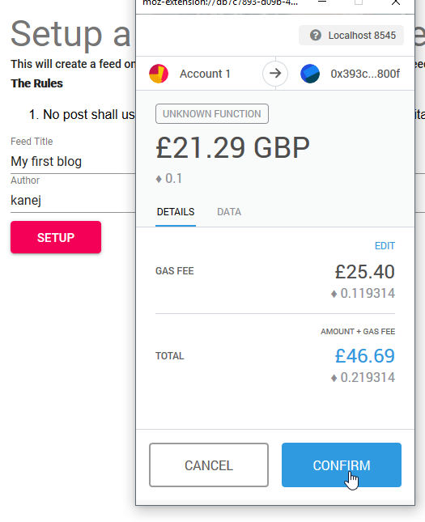

6. You should be taken to the new Microblogs page, note the settings cog which takes you to the blog's settings page and the `OpenWit Approved` link that will take you back to the homepage:

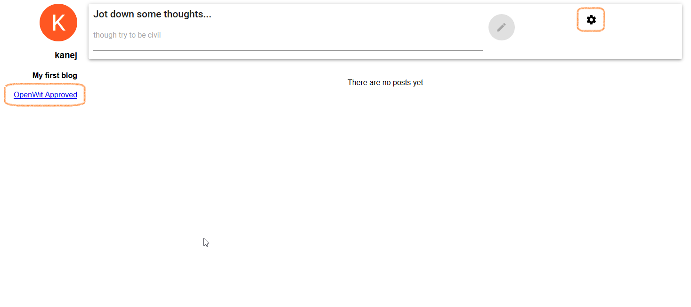

Add a new post to your blog
---------------------------

As the owner of a blog you can add new posts, assuming you have not locked the blog.

To add an entry, from the blog's page:

1. Enter in some text in the input box at the top of the page

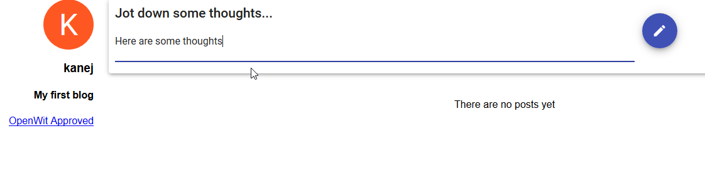

2. Either hit the enter button or click the pencil button

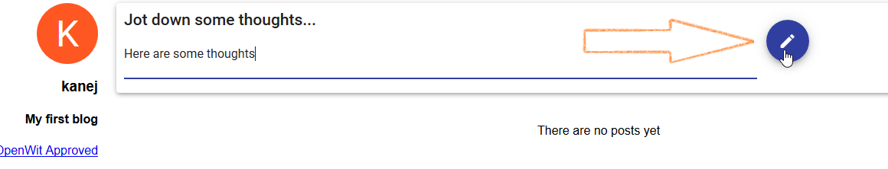

3. Confirm the Metamask transaction

4. The text should appear as an entry in the blog. Note that a user of a different account that was on that blog page should see the new entry update on their screen without a refresh.

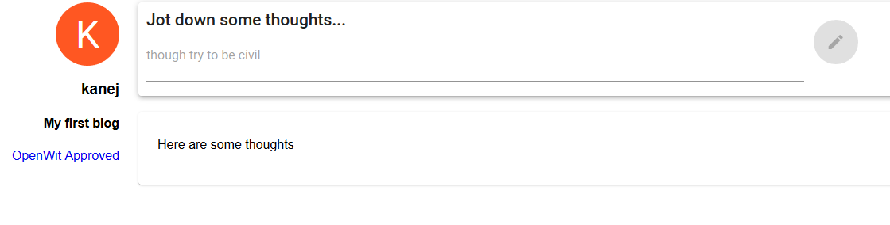

Lock your blog
--------------

As an owner you can lock your blog, which will stop the blog from accepting new posts. It will also disable ownership transfer, though the owner will still be able to destroy the blog. A locked blog can be unlocked by the owner.

To lock the blog, starting on the blogs page and logged in as the owner in Metamask:

1. Go to the settings page for the blog using the `Cog` button on the top right

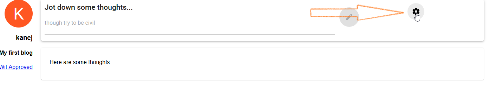

2. On the setting page toggle the Lock switch:

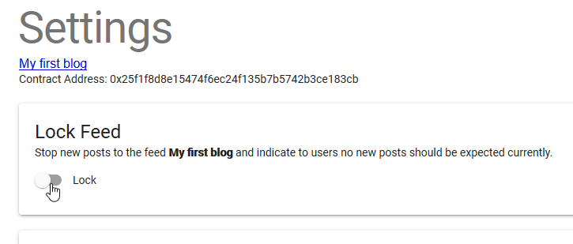

3. Confirm the Metamask transaction

4. The `Start Transfer` button should now be grayed out. If you go back to the blog page, you should see a message indicating it is locked and the new entry input box should be disabled.

The unlock process follows the same steps.

Transfer ownership of your blog to another account
--------------------------------------------------

Assuming you are the owner, you can transfer the ownership of the blog to another account. You will
no longer be able to post or affect the blog; those powers transfer to the new owner.

To transfer ownership, starting on the blog's page and logged in as the owner in Metamask:

1. Copy the account address of the Account you want to switch ownership too (i.e. Account 2 in Metamask)

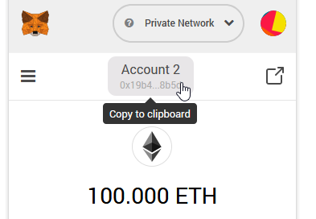

2. Go to the settings page for the blog using the `Cog` button on the top right

3. Click the `Start Transfer` button

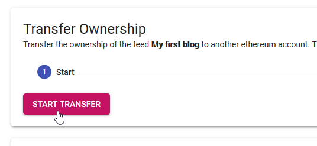

4. Enter in the account address of the new owner

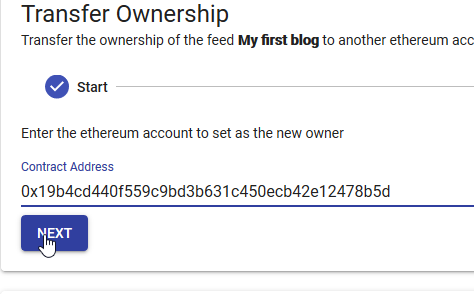

4. Click the confirm button

5. Confirm the Metamask transaction

6. You should now see the `Not Authorised` screen

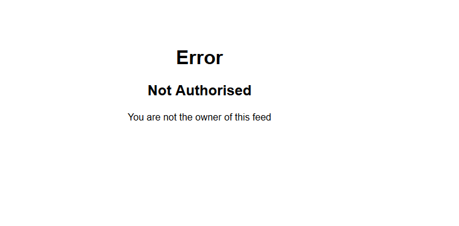

7. Switching to the new account and going to the blog should now show the input and setting options that only an owner should see.

Destroy your blog
-----------------

An owner always has the option of destroying the blog. This destroys the contract on the ethereum network,
and hence removes the pointer to the data (blog posts) on IPFS, but they may remain on IPFS, it is indellible so take care in what you post.

1. On the page of a blog you own, go to the settings page for the blog using the `Cog` button on the top right

2. Click the `Destroy` button

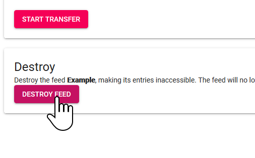

3. Confirm the Metamask transaction

4. You will be taken to the home page but clicking back **and refreshing** will show that the blog is no longer accessible:


Report a blog in violation of the registries Code of Conduct
------------------------------------------------------------

If a blog writer breaks the Code of Conduct (includes the lowercase word `inheritance` in a post), then any user (other than the owner of the blog), should be able to report the violation.

Before running through this use case ensure, in addition to ganache and the dev webserver:

IPFS is running:

```bash
ipfs daemon
```

The oracle service is running:

```bash
node ./oracle/oracleService.js
```

If you run the setup test data script it will create a blog that violates the rules:

```bash
node ./scripts/setupTestData.js 
```

To report a blog then, starting on the homepage:

1. Navigate to the blogs page, `Misbehaving` in the test data:

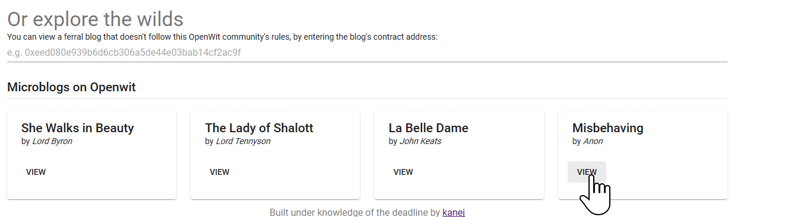

2. Click the `report` button against the offending entry

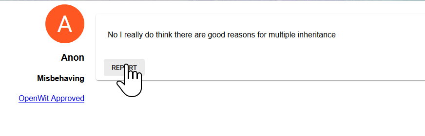

3. Confirm the Metamask transaction

4. The blog UI will update to show it is `Under Review`

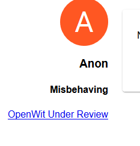

5. The oracle service should process the request

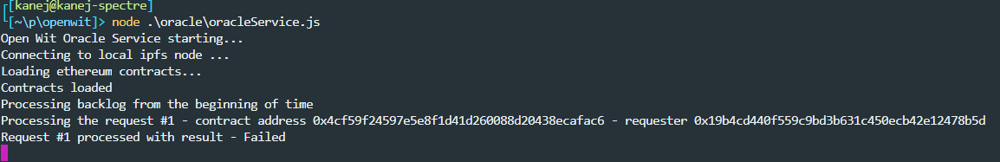

6. A refresh of the page will show it is banned

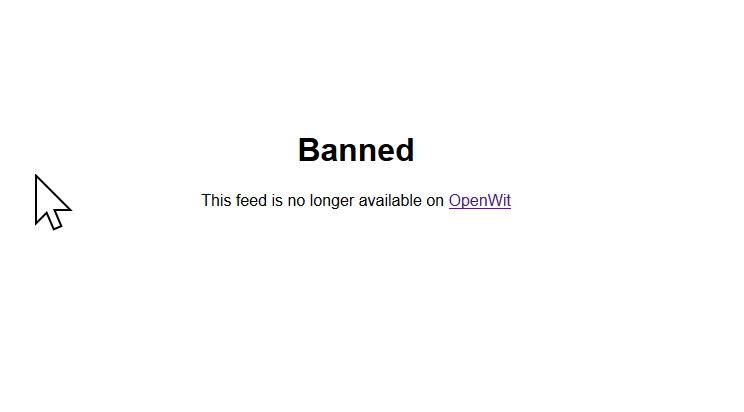

The home page will no longer show the feed either.
