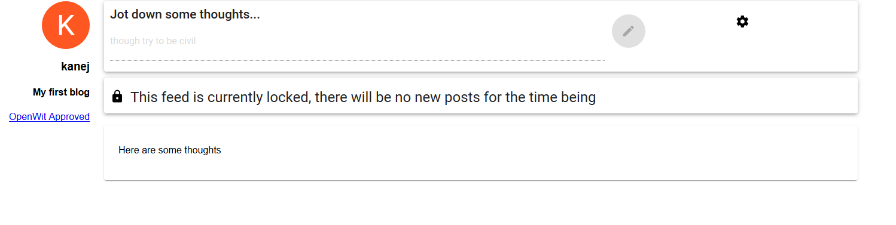

Use Cases
=========

## Table of Contents

- [Setup for basic Use Cases](#Simple-Setup-for-basic-Use-Cases)
- [Create a new blog linked to the OpenWitRegistry](#Create-a-new-blog-linked-to-the-OpenWitRegistry)
- [Add a new post to your blog](Add-a-new-post-to-your-blog)
- [Lock your blog](Lock-your-blog)
- [Transfer ownership of your blog to another account](Transfer-ownership-of-your-blog-to-another-account)
- [Destroy your blog](Destroy-your-blog)
- [View an existing blog not connected with a Registry](View-an-existing-blog-not-connected-with-a-Registry)

Setup for basic Use Cases
-------------------------

Before running through the use cases ensure you have a running setup:

In one terminal tab run ganache from the root of the project with

```bash
npm run dev:ganache
```

With ganache running, migrate the contracts with

```bash
truffle migrate
```

Use Firefox or Chrome with the Metamask plugin and restore an account with the seed phrase:

> ostrich high museum cheap fade about much voyage exist common deposit distance

Make sure Metamask is connected to the **local private network** on port 8545.

Run the OpenWit website on the devserver in another tab with:

```bash
npm run start
```

Navigate to the OpenWit website at `http://localhost:3000`

Create a new blog linked to the OpenWitRegistry
-----------------------------------------------

A registry ties multiple blogs together, and allows enforcement of a Code of Conduct through
a smart contract.

A empty registry will have been deployed with the setup migration. To create a new blog:

1. Go to the homepage at `http://localhost:3000`
2. Click on the `Setup Microblog` button to go to the Setup Page (note the homepage recognises which account you are logged in as in Metamask)


3. Enter in a title for the blog and an author, both must be at least 3 characters, and click `Setup`


4. Creating a blog requires staking 0.1 ether on top of the gas used in its creation. Failing to keep the (hardcoded) rules of OpenWit will allow others to claim that stake and ban the blog from the registry. The only rule currently is the noddy example rule that the lowercase word `inheritance` is banned from posts. I am sure you can think of more appropriate words to ban and more sophisticated rules generally, but if you are from the Functional Programming side of the fence then `inheritance` really should be banned.
5. Clicking setup will open a transaction in Metamask that will create a new blog through the registry contract, confirm it:


6. You should be taken to the new Microblogs page, note the settings cog which takes you to the blog's settings page and the `OpenWit Approved` link that will take you back to the homepage:


Add a new post to your blog
---------------------------

As the owner of a blog you can add new posts, assuming you have not locked the blog.

To add an entry, from the blog's page:

1. Enter in some text in the input box at the top of the page


2. Either hit the enter button or click the pencil button


3. Confirm the Metamask transaction

4. The text should appear as an entry in the blog. Note that a user of a different account that was on that blog page should see the new entry update on their screen without a refresh.


Lock your blog
--------------

As an owner you can lock your blog, which will stop the blog from accepting new posts. It will also disable ownership transfer, though the owner will still be able to destroy the blog. A locked blog can be unlocked by the owner.

To lock the blog, starting on the blogs page and logged in as the owner in Metamask:

1. Go to the settings page for the blog using the `Cog` button on the top right


2. On the setting page toggle the Lock switch:


3. Confirm the Metamask transaction

4. The `Start Transfer` button should now be grayed out. If you go back to the blog page, you should see a message indicating it is locked and the new entry input box should be disables:

The unlock process follows the same steps.

Transfer ownership of your blog to another account
--------------------------------------------------

Assuming you are the owner, you can transfer the ownership of the blog to another account. You will
no longer be able to post or affect the blog; those powers transfer to the new owner.

To transfer ownership, starting on the blog's page and logged in as the owner in Metamask:

1. Copy the account address of the Account you want to switch ownership too (i.e. Account 2 in Metamask)


2. Go to the settings page for the blog using the `Cog` button on the top right


2. Click the `Start Transfer` button


3. Enter in the account address of the new owner



4. Click the confirm button

5. Confirm the Metamask transaction

Destroy your blog
-----------------

An owner always has the option of destroying the blog. This destroys the contract on the ethereum network,
and hence removes the pointer to the data (blog posts) on IPFS, but they may remain on IPFS, it is indellible so take care in what you post.

View an existing blog not connected with a Registry
---------------------------------------------------

Any user should be able, given the address of an OpenWit microblog contract, to view that feed. Accounts other than the owner will not be able to add a new entry in the blog.

Report a blog in violation of the registries Code of Conduct
------------------------------------------------------------

TBD
